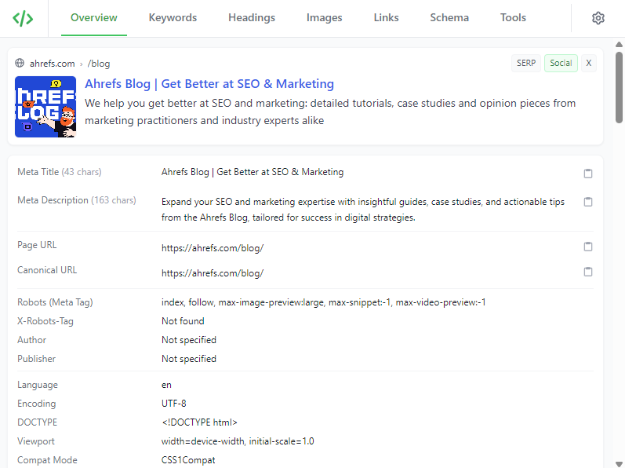
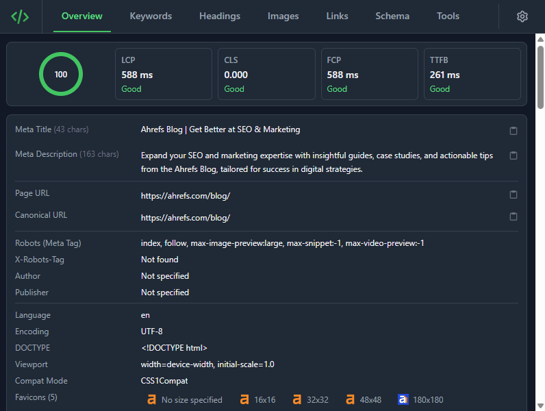

# GoSEO

On-page SEO analysis for Chrome

[](https://opensource.org/licenses/MIT)
[]()

Check meta tags, keywords, headings, images, links, and schema on any webpage.

<p align="center">
  
  
</p>

## Features

- **Core Web Vitals** - LCP, CLS, FCP, and TTFB metrics
- **Meta tags** - Titles, descriptions, Open Graph, Twitter cards, canonicals
- **Keywords** - Density analysis for 1-5 word phrases with CSV export
- **Headings** - H1-H6 structure validation and hierarchy checks
- **Images** - Alt text coverage, file sizes, optimization opportunities
- **Links** - Internal/external analysis, nofollow detection, broken link checking
- **Schema** - Structured data viewer (JSON-LD, Microdata, RDFa)
- **Tools** - Quick links to Search Console, PageSpeed Insights, validators

---

## Tech Stack

- React 19 + TypeScript
- Tailwind CSS + shadcn/ui
- Chrome Extension Manifest V3
- Vite

---

## Installation

### From Chrome Web Store
[Install GoSEO](#)

### From Source
```bash
git clone https://github.com/rajakhoury/goseo.git
cd goseo
npm install
npm run build
```

Load the `dist` folder as an unpacked extension in Chrome (`chrome://extensions/` → Developer mode → Load unpacked).

---

## Development
```bash
npm run dev      # Watch mode with hot reload
npm run build    # Production build
npm run lint     # Run ESLint
```

---

## Contributing

Pull requests welcome. For major changes, open an issue first.

---

## License

MIT © [Raja Khoury](https://github.com/rajakhoury)